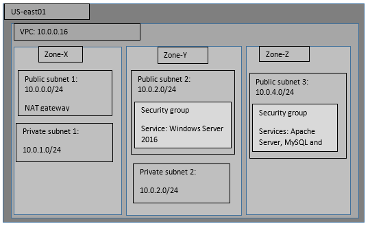

# Project Infrastructure

This `README.md` provides an overview of the social media application's infrastructure which is managed by Terraform and hosted on AWS.

## Infrastructure Diagram

To visualize the infrastructure setup, refer to the diagram below:



## Infrastructure Details

The setup spans three availability zones within the AWS `US-east01` VPC:

- **Zone-X**:
  - Public subnet: `10.0.0.0/24`
  - Private subnet: `10.0.1.0/24`
  - NAT gateway for private subnet outbound traffic
- **Zone-Y**:
  - Public subnet: `10.0.2.0/24`
  - Private subnet: `10.0.2.0/24`
  - Security group
  - Windows Server 2016
- **Zone-Z**:
  - Public subnet: `10.0.4.0/24`
  - Security group
  - Services: Apache Server, MySQL, etc.

## Using Terraform to Deploy

Follow these steps to deploy the infrastructure using Terraform:

1. Initialize the Terraform environment:
   ```sh
   terraform init
   ```
2. Review the Terraform plan to ensure the correct resources will be created:
   ```sh
   terraform plan
   ```
3. Apply the Terraform configuration to provision the AWS resources:
   ```sh
   terraform apply
   ```

Ensure your AWS CLI is configured with the necessary permissions before executing these commands.

For detailed configuration, refer to the Terraform files within this repository.
